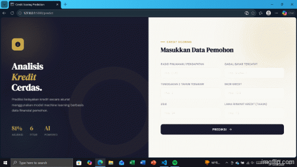
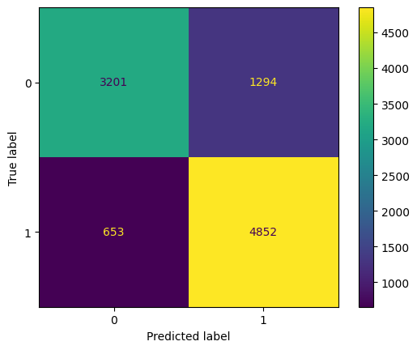

## End-to-End Loan Approval Prediction Pipeline
#### Overview
The End-to-End Loan Approval Prediction Pipeline is a machine learning system designed to automatically assess loan eligibility based on historical customer data. The pipeline covers the complete workflow, including data ingestion, preprocessing, feature engineering, model training, hyperparameter optimization, and deployment into a production environment. By adopting an end-to-end approach, this system aims to improve the efficiency and consistency of credit evaluation processes, reduce human bias and operational errors, and support financial institutions in making faster, more accurate, and data-driven lending decisions.

#### Demo Application
The project can be integrated into a simple web-based application that allows users to input customer data and receive real-time loan approval predictions generated by the trained machine learning model.
###### Demo Preview

###### Demo Features
- User-friendly form for inputting applicant and loan-related data
- Real-time loan approval prediction
- Display of prediction probability/confidence score
- Clear output indicating approved or rejected loan status
- Simple and responsive web interface for better user experience
#### Key Features
- End-to-end machine learning pipeline for loan approval prediction from data ingestion to deployment
- Automated data preprocessing including missing value handling.
- Feature engineering to extract and optimize relevant patterns from financial and customer data
- Model training using Random Forest with hyperparameter tuning via Optuna
- Model evaluation using accuracy, precision, recall, F1-score, and ROC-AUC
- Reproducible and modular pipeline structure for scalability and maintainability
- Production-ready workflow enabling consistent and automated prediction outputs

#### Methodology
###### Dataset
The dataset used in this project was obtained from a publicly available dataset on Kaggle and consists of structured financial and customer data used for risk credit prediction. The dataset includes various features such as applicant demographics, income level, credit history, employment status, and loan-related attributes that are used to determine loan eligibility.

The dataset was processed and split into training, validation, and testing subsets to ensure proper model evaluation and reliable generalization performance

###### Data Preprocessing
- Handling missing values using appropriate imputation techniques
- Outlier detection and treatment to improve data quality
- No feature scaling applied, as Random Forest is not sensitive to feature magnitude
- No encoding required since all features are already in numerical format
- Splitting dataset into training, validation, and testing sets
###### Model Development
- Implementation of Random Forest as the primary classification model
- Hyperparameter tuning using Optuna to optimize model performance
- Feature importance analysis to identify key contributing variables
- End-to-end pipeline design for training and prediction workflow automation
###### Model Evaluation
- Accuracy
- Precision
- Recall
- F1-score
- Confusion matrix

#### Result
###### classification-report
              precision    recall  f1-score   support

           0       0.83      0.71      0.77      4495
           1       0.79      0.88      0.83      5505

    accuracy                           0.80     10000
   macro avg       0.81      0.80      0.80     10000
weighted avg       0.81      0.80      0.80     10000
The model demonstrates strong overall performance in predicting loan approval outcomes, achieving an accuracy of approximately 80% on 10,000 test samples. However, performance varies between the two classes.

- Class 0 (Rejected Loan) shows good performance with a precision of 0.83 and recall of 0.71, indicating that while the model is fairly accurate when predicting rejections, it still misses a portion of actual rejected cases.
- Class 1 (Approved Loan) performs better in recall (0.88), meaning the model successfully identifies most approved loans. However, its precision of 0.79 indicates that some rejected loans are incorrectly predicted as approved.

The macro and weighted average F1-scores (0.80) indicate a balanced overall performance across both classes, with no severe class imbalance effect. However, the difference in recall between classes suggests the model is slightly biased toward predicting approvals.

Overall, the model is suitable for initial credit risk screening, but further tuning may be required to reduce false approvals and improve risk control in real-world financial decision-making

The model shows strong and consistent performance between training and testing phases. The Train F1-score of 0.844 indicates that the model fits the training data well, capturing important patterns without excessive error. Meanwhile, the Test F1-score of 0.833 demonstrates that the model generalizes effectively to unseen data.

Train F1: 0.8438749623769187
Test F1:  0.8325038613351639

The small gap between training and testing performance suggests that the model has a good balance between bias and variance, with no significant signs of overfitting. Overall, the Random Forest model provides stable predictive performance and is suitable for deployment in a loan approval prediction system.

###### confusion matrix

The model achieves a solid overall accuracy of approximately 80.5% on a test set of 10,000 instances.

Performance on the positive class (Class 1) is strong, with a recall of 88.14% indicating the model successfully identifies most positive cases.

However, precision is slightly lower at 78.95%, meaning about 21% of positive predictions are false positives (1,294 instances).

Specificity for Class 0 is 71.21%, suggesting the model has moderate ability to correctly identify negative cases but tends to misclassify a notable number of negatives as positives.

#### Conclusion
This project demonstrates the effectiveness of predicting loan approval status using the developed model and highlights both the strengths and limitations of the current approach. The confusion matrix shows that the model achieves a total accuracy of 80.53%, with 4,852 true positives (loans correctly approved) and 3,201 true negatives (loans correctly rejected). However, the presence of 1,294 false positives (loans incorrectly approved) and 653 false negatives (loans incorrectly rejected) indicates that the model still struggles with certain risk profiles. While the model performs strongly in identifying applicants who will repay loans achieving 88.14% recall further improvements are required to enhance classification accuracy, particularly in reducing false approvals that could lead to financial losses

#### Author
BINTANG FEBRU KARUNIA
LinkedIn: https://linkedin.com/in/bintang-febru-karunia
GitHub: https://github.com/Bintangfebru